# Care24Japan Revision Report

HTML version: [Open the visual report](./care24-revision-report.html)

Date: 2026-09-17  
Source: `/Users/ilham/Downloads/care24Japan website revision(3).xlsx`  
Scope: `シート1`, rows 1–55, columns A–Z, including 59 embedded images.

## Summary

The previously failing visual items have been updated:

- Request 13 / sheet row 15: mobile consultation copy now breaks after `ご家族の`.
- Request 15 / sheet row 17: payment copy now breaks after `お支払いは`; desktop typography keeps the second line intact.
- Request 17 / sheet row 19: pricing link now breaks after `を` on mobile.
- Request 18 / sheet row 20: medical note mobile line breaks now follow the client specification; the icon is smaller on mobile and no longer contains `処方箋`.
- Request 19 / sheet row 21: user banner eyebrow renders the CMS API value `サービスをご利用されたい方`; balanced mobile wrapping removes the lone `方`.
- Hero media: the published `home-hero.image` field was corrected to the production-matching `_hero-preview.png` photo through an Atlas media record; no runtime image fallback was added.
- Mobile follow-up QA: at 375px and 320px, the nursing heading and apply-banner eyebrow now use balanced wrapping so `は、` and `方` no longer appear alone.
- Request 24 / sheet row 26: `処方箋` text was removed from the document icon.
- Shared query/loading/error labels and contact-form status messages now resolve from required Atlas API fields; runtime rendering no longer imports bundled copy or uses a URL fallback. The live `site` page was updated without overwriting its existing dashboard edits.
- The isolated `content.micsHref` field now renders a field-specific `[cms-field-error: ...]` diagnostic when empty or malformed, so one bad CMS URL cannot become a project-wide React Application error.

Requests 1 and 4 were already implemented in the current branch and were rechecked in the browser. Physical-device verification and final client sign-off are still required for those items.

## Complete task report

| Request | Sheet row | Client requirement / status | Update or verification | Evidence |
|---:|---:|---|---|---|
| 1 | 3 | Mobile FV order and first-view composition | CTA appears before supported area; hero copy no longer overlaps the image; the published Atlas hero now uses the same approved photo as production (`_hero-preview.png`). | [Production mobile FV screenshot](../audit-after-hero-mobile.png), [CMS hero after fix](../audit-after-hero-cms-375.png) |
| 2 | 4 | Add Contact Us beside FAQ | Workbook status is OK. | Workbook row 4 |
| 3 | 5 | Mobile navigation adjustment | Workbook status is OK. | Workbook row 5 |
| 4 | 6 | Sticky Phone + Contact CTA after FV | Current branch has full-width desktop CTA, pink `お問合せ` side, stronger button affordance, and mobile split CTA. | [Production desktop screenshot](../qa-final-desktop.png), [earlier desktop screenshot](../audit-after-sticky-desktop.png) |
| 5 | 7 | Footnote color under supported area | Workbook status is OK. | Workbook row 7 |
| 6 | 8 | Mobile line break and CTA visibility while hamburger menu is open | Workbook status is OK; production-build browser check at 375px and scrollY 900 confirms the fixed bottom CTA remains visible over the open menu. | [Production menu-open screenshot](../qa-final-menu-mobile.png), [earlier screenshot](../audit-after-menu-mobile.png) |
| 7 | 9 | Qualified staff line break | This is a duplicate/reference of Request 8 (sheet row 10). Row 10 carries the client status `OK です`, and the same implementation covers both rows; no separate code change is needed. | Workbook row 9 images; Request 8 / sheet row 10 status |
| 8 | 10 | Qualified staff line break | Workbook status is OK. | Workbook row 10 |
| 9 | 11 | Minimum two-hour line break | Workbook status is OK. | Workbook row 11 |
| 10 | 12 | Insurance-excluded support line break | Workbook status is OK. | Workbook row 12 |
| 11 | 13 | Pricing/payment card layout | 7:3 desktop ratio and non-breaking pricing notes are present; workbook status is OK. | Workbook row 13 |
| 12 | 14 | Service-flow report line break | Workbook status is OK. | Workbook row 14 |
| 13 | 15 | Consultation copy must not leave a lone `の` on mobile | Added a mobile-only editorial break after `ご家族の` and reduced only mobile body text to 13px so the requested two lines fit at 375px. Desktop remains unchanged. | [Mobile screenshot](../audit-after-apply-mobile.png), [desktop screenshot](../audit-after-apply-desktop.png) |
| 14 | 16 | ISMS line breaks | Workbook status is OK. | Workbook row 16 |
| 15 | 17 | Bank-transfer payment copy | Added explicit break after `お支払いは`; desktop uses a smaller card-body size so `銀行振込（前払い）となります。` remains one line. | [Mobile screenshot](../audit-after-payment-mobile.png), [desktop screenshot](../audit-after-payment-desktop.png) |
| 16 | 18 | Nursing fee/transport notes | Workbook status is OK. | Workbook row 18 |
| 17 | 19 | Pricing link mobile break | Pricing links now break after `詳しくはこちら（料金ページ）を`; desktop stays one line. | [Mobile screenshot](../audit-after-payment-mobile.png) |
| 18 | 20 | Medical-note mobile line breaks and prominent document icon | Added the specified mobile line breaks, reduced the mobile icon footprint to prevent lone-character wrapping, and removed `処方箋` lettering. | [Mobile screenshot](../audit-after-medical-mobile.png) |
| 19 | 21 | Apply-banner wording and wrapping | Eyebrow renders the CMS API value `サービスをご利用されたい方`; balanced mobile wrapping removes the lone `方` at 375px and 320px. | [375px screenshot](../audit-after-apply-balanced-375.png), [320px screenshot](../audit-after-apply-balanced-320.png), [desktop screenshot](../audit-after-apply-desktop.png) |
| 20 | 22 | Free consultation link | Workbook status is PASS/OK. | Workbook row 22 |
| 21 | 23 | Bank-transfer payment section | Workbook status is OK. | Workbook row 23 |
| 22 | 24 | FAQ pricing link | Workbook status is OK. | Workbook row 24 |
| 23 | 25 | Row contains only task number `23` | No request text, feedback, or status exists in columns C–Z; cannot implement or mark pass without clarification. | [Source workbook](/Users/ilham/Downloads/care24Japan%20website%20revision(3).xlsx) |
| 24 | 26 | Remove text from icon | Removed all `処方箋` characters from the nursing directive illustration. | [Mobile screenshot](../audit-after-medical-mobile.png) |

## Rows 27–55 and embedded images

Rows 27–55 do not contain additional task descriptions. They are supporting screenshot/mockup areas: row 32 contains only `4`, row 49 contains an image anchor, row 51 contains `Mockup⇒`, and the remaining cells are blank or image-only. The 59 embedded images were checked against their task rows; they do not introduce additional independent pass/fail tasks.

## Screenshot evidence

The following screenshots are the browser QA evidence referenced in the table above:

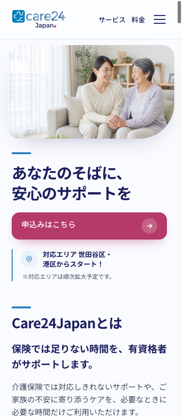
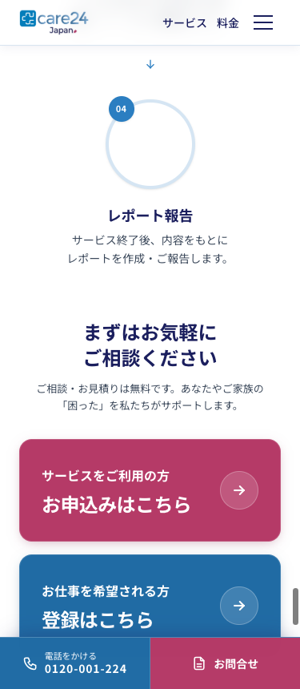
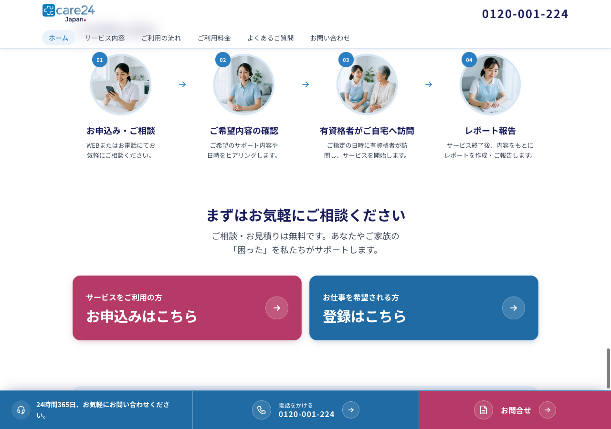
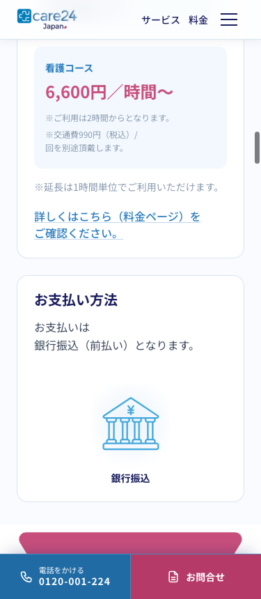
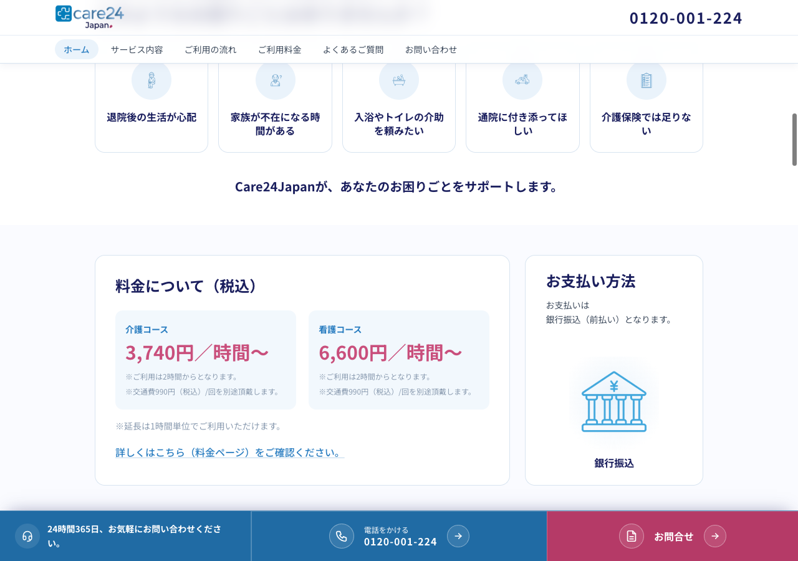
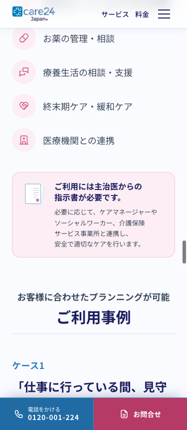
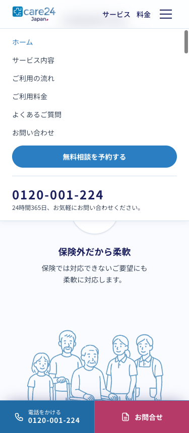
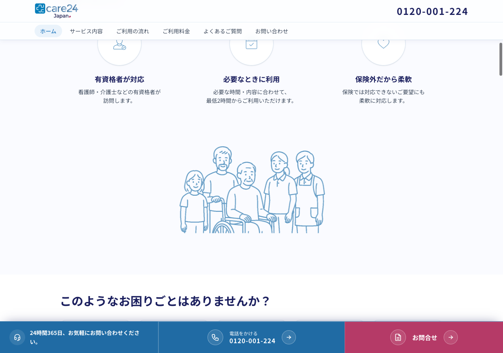

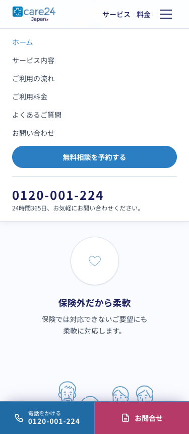
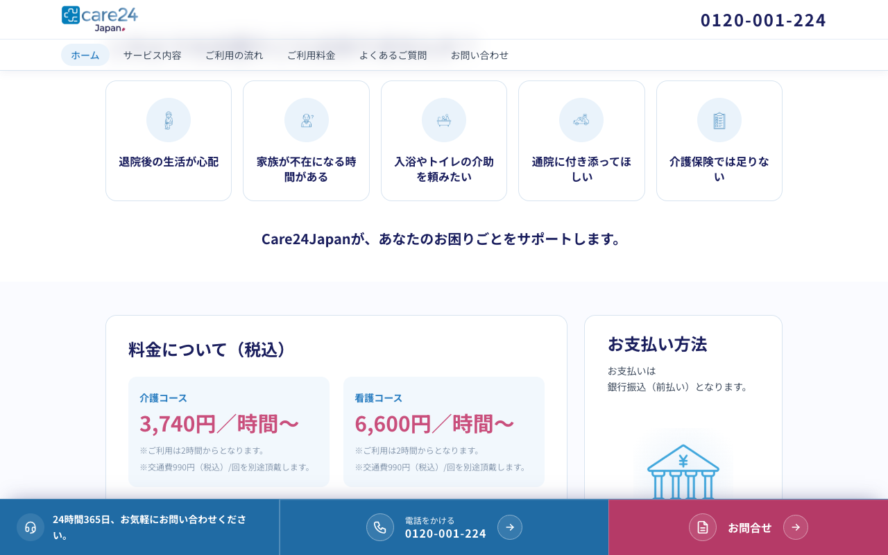
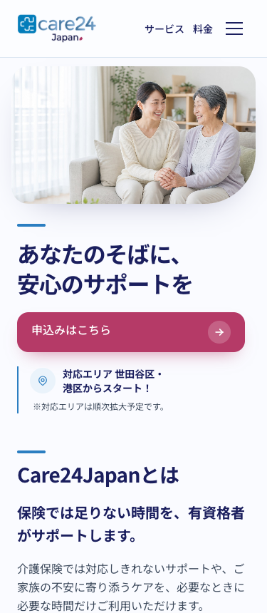
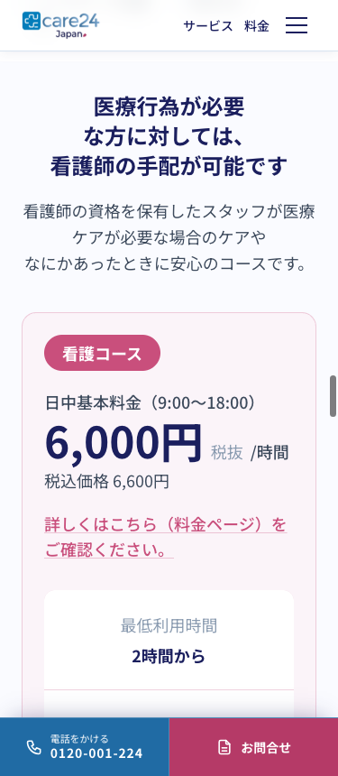
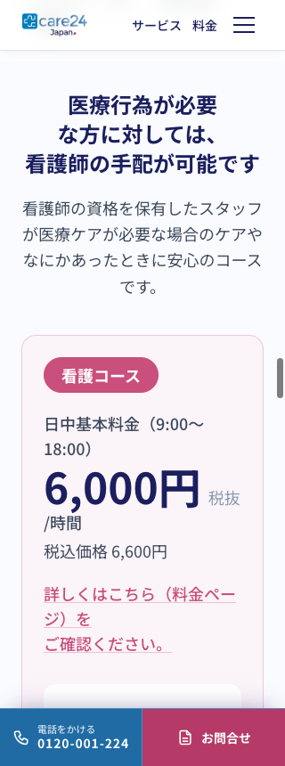
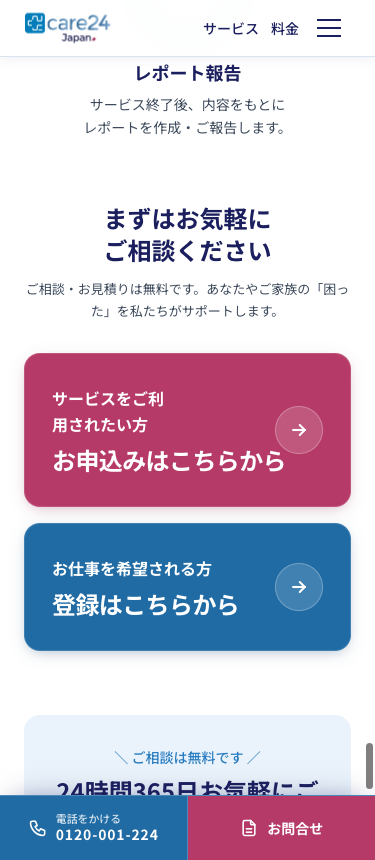
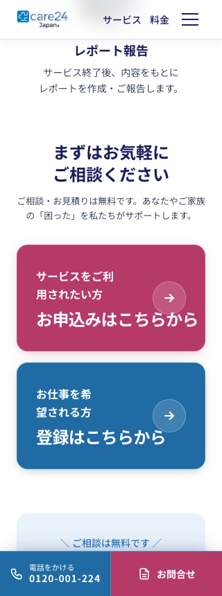

## Verification performed

- Fresh focused TypeScript/TSX regression set: **53/53 passed**, including CMS field diagnostics, BFF transient retry, query-boundary checks, homepage rendering, and the 375/320 mobile wrapping cases.
- Full repository test script: **315/315 passed** across all 13 test batches (including the focused responsive/CMS regression set, legal/SEO mappings, contact validation, and API boundary checks).
- Live Atlas verification: `site-ui-labels.query_*` and `site-cta.sticky_*` fields are present in the published API response; the client-requested pink label is API value `お問合せ`, and the existing six nav items/footer state were preserved.
- Local ESLint on all changed files: **passed**.
- Production build (`pnpm build`): **exit 0** (fresh run; TypeScript and 32/32 static pages completed).
- Fresh production server (`pnpm start`) returned **HTTP 200** on both `http://127.0.0.1:3000/` and `http://192.168.1.3:3000/`; the rendered HTML contained neither `Application error` nor `Minified React error`.
- The live homepage API now returns the new Atlas hero media URL ending in `hero-preview.jpg`; `home-hero.cta_primary_href` and `home-hero.cta_secondary_href` are also read from Atlas. The fetched image matches the production composition and is used by the rendered page.
- Browser checks at 375px and 320px show balanced nursing and apply-banner lines with no standalone `は、` or `方`.
- Project agent rule saved in `AGENTS.md`: isolate field-level CMS failures, keep unrelated sections usable, and never add runtime hardcoded content fallbacks.
- Production-build browser QA at 375px mobile and 1280px desktop: completed; screenshots are attached above. The menu-open check was performed after scrolling to `scrollY=900`, and the desktop CTA check after scrolling past the FV.
- `pnpm start` is running on port 3000 for manual phone QA; localhost and LAN requests both returned HTTP 200 with no Application/Minified React error markers.

The screenshots are browser evidence, not physical-device evidence. The workstation has no configured iOS/device provider, so the client’s requested real-smartphone check for the FV and sticky CTA remains the final manual QA step.
