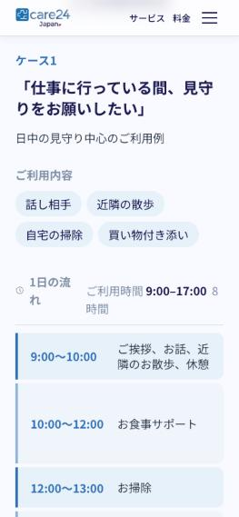
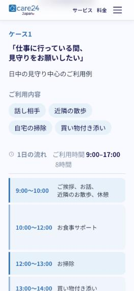
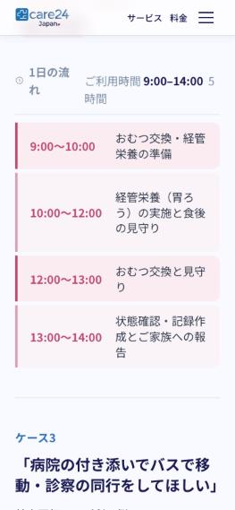
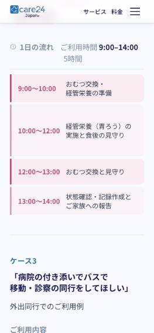
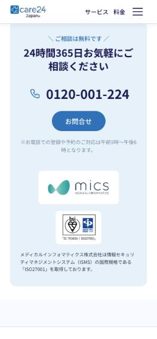
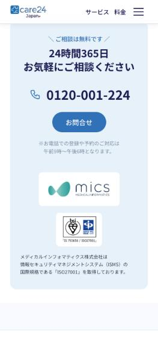
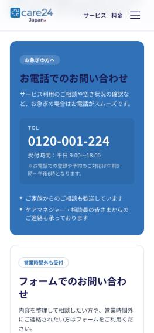
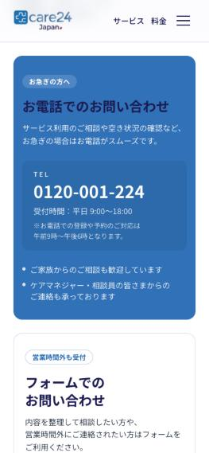

# Care24Japan Revision Report — Sheet (7)

HTML version: [Open the visual report](./care24-revision-report.html)

Date: 2026-09-30
Source: `/Users/ilham/Downloads/care24Japan website (7).xlsx` (`シート1`, rows 3–33, column J "last feedback")
Branch: `client-revision-plan` — commits `7cc57d0` (Atlas patches) and `216a795` (phrase wrapping)
Previous report (sheet (3)) is kept in git history.

## Summary

Every row that was still open in sheet (7) was about Japanese line breaks on iPhone SE (375px), plus a few desktop line breaks. Feedback J16 changed the approach: the client asked for **natural phrase-based wrapping at every screen size, without hardcoded ` ` tags**. Earlier rounds fixed each sentence with a hand-placed break, so every new sentence needed its own patch.

This round replaces that with one rule for the whole site:

- `lib/phrase.ts` splits Japanese into phrases with Google's BudouX. A few extra rules come from the client's approved breaks:
  - `なります`, `ください`, `です`, and `ます` never start a line.
  - A closing phrase of ≤2 characters stays with the phrase before it (`1日の流れ`).
  - `お気軽に` and short `〜の` modifiers stay with the next phrase (`あなたのお困りごと`, `近隣のお散歩`, `お急ぎの場合は`).
  - A line may break after `にて`.
- `components/PhraseText.tsx` renders each phrase as an unbreakable unit, with a break opportunity (`<wbr>`) between units. A word therefore never splits in the middle, including on iOS Safari, which does not support the CSS-only `word-break: auto-phrase`.
- It is used for all Japanese copy on every page: home, contact, FAQ, pricing, fees, service flow, use case, company, navbar, footer, and sticky CTA.

Rows already marked `OK です` (1–5, 7–13, 15–16, 18–22, 24) were not reopened. Row 9 duplicates row 10, and row 25 is empty.

## Results by area

Before = live site www.care24.jp (current production code), measured in the browser on 2026-09-30.
After = this branch, production build (`pnpm build && pnpm start`).
Breaks are written with `/`. Mobile values are at 375px (iPhone SE) and desktop values at 1280px.

### TOP page — About (#6, row 8)

| Item | Before | After | Why |
|---|---|---|---|
| Subtitle (SP) | `保険では足りない時間を、有資格者 / がサポートします。` | `保険では足りない時間を、 / 有資格者がサポートします。` | Matches the client's correct break exactly. |
| Body (SP) | `…サポートや、ご / 家族の不安に…` | `…サポートや、 / ご家族の不安に…` | `ご家族` no longer splits. The approved desktop break is unchanged. |

### TOP page — ISMS statement (#14, row 16 / J16)

| Item | Before | After | Why |
|---|---|---|---|
| Home contact block (SP) | `…株式会社は情報セキュリ / ティマネジメントシステム…` | `…株式会社は / 情報セキュリティマネジメントシステム（ISMS）の / 国際規格である「ISO27001」を取得しております。` | Phrase wrapping keeps the compound word whole. |
| Home contact block (PC) | `…情報セキュリティマ / ネジメントシステム…` | `…株式会社は / 情報セキュリティマネジメントシステム（ISMS）の / 国際規格である…` | The hardcoded `\n` in Atlas (`情報セキュリティ\nマネジメント`) was the "hardcoded break" J16 rejects. It was removed from `home-contact.isms` with `scripts/atlas/patch-task14-isms-breaks.ts`, and only that field changed. |
| Footer (PC) | `…国際規格で / ある…` | Breaks only between phrases | Same component. |

### TOP page — Pricing link (#17, row 19)

| Item | Before | After | Why |
|---|---|---|---|
| Pricing card link (PC) | `詳しくはこちら（料金ページ）をご確認く / ださい。` (nursing card) | `詳しくはこちら（料金ページ）をご確認ください。` on one line (1024px and 1280px) | The desktop copy is locked to one line from `lg`, as requested in J19. |
| Pricing card link (SP) | Already OK | `詳しくはこちら（料金ページ）を / ご確認ください。` | Unchanged. |

### Contact page (#25a, row 28)

| Item | Before | After | Why |
|---|---|---|---|
| Phone card description (SP) | `…空き状況の確認な / ど、お急ぎの場合は…` | `サービス利用のご相談や空き状況の確認など、 / お急ぎの場合はお電話がスムーズです。` | Matches the client's break exactly. The card's mobile padding went from 24px to 16px, so the 21-character first clause fits. |
| Phone card description (PC) | Unchanged | `…確認など、 / お急ぎの場合は…` | Matches the client's break. |
| Phone hours note (SP) | `※お電話での登録や予約のご対応は午前9 / 時〜午後6時となります。` | `※お電話での登録や予約のご対応は / 午前9時〜午後6時となります。` | Matches the client's break exactly. |
| Form card title (SP) | `フォームでのお問い合わ / せ` | `フォームでの / お問い合わせ` | Same orphan problem, fixed by the same rule. |

### TOP page — Sticky footer CTA and contact banner (#25b, row 29)

| Item | Before | After | Why |
|---|---|---|---|
| Sticky phone note (SP) | `※お電話での登録や予約のご対応 / は午前9時〜…` | `※お電話での登録や予約のご対応は / 午前9時〜午後6時となります。` | Matches the client's break exactly. The mobile button padding is 4px tighter so the first line fits. |
| Sticky left text (PC) | `24時間365日、お気軽にお問い合わせく / ださい。` | `24時間365日、 / お気軽にお問い合わせください。` | Matches the client's break exactly. At tablet width (768px), the headset icon is hidden and the text is 12px so the same two lines fit. |
| Sticky middle note (PC) | `…午前9時〜午後6時 / となります。` | `※お電話での登録や予約のご対応は / 午前9時〜午後6時となります。` | Matches the client's break exactly. |
| Contact banner heading (SP) | `24時間365日お気軽にご / 相談ください` | `24時間365日 / お気軽にご相談ください` | Matches the client's break exactly. |
| Banner phone note (SP) | `…午前9時〜午後6 / 時となります。` | `…ご対応は / 午前9時〜午後6時となります。` | Matches the client's break exactly. |

### TOP page — Problems closing line (#26, row 30)

| Item | Before | After | Why |
|---|---|---|---|
| Closing line (SP) | `Care24Japanが、あなたのお困りごと / をサポートします。` | `Care24Japanが、 / あなたのお困りごとをサポートします。` | No phrase is split any more. The CMS text has `、` after `が`, which the client's two suggested layouts do not have, so the result is close to their three-line option but not identical. The copy was not changed (the CMS owns it). |

### TOP page — Use-case examples (#27 row 31, #28 row 32)

| Item | Before | After | Why |
|---|---|---|---|
| Case 1 heading | `…間、見守 / りをお願いしたい」` | `「仕事に行っている間、 / 見守りをお願いしたい」` | Matches the client's break exactly. |
| Schedule header (all cases) | `1日の流 / れ`, `…8 / 時間` | `1日の流れ`, `8時間` (never split) | The label is locked to one line, and a short closing phrase always stays attached. |
| Case 1 9:00〜10:00 | `ご挨拶、お話、近 / 隣のお散歩、休憩` | `ご挨拶、お話、 / 近隣のお散歩、休憩` | Matches the client's break exactly. The time column is narrower on mobile (104px, 16px text), so the activity column fits about 11 characters. |
| Case 3 heading | `…バスで移 / 動・診察…` | `「病院の付き添いでバスで / 移動・診察の同行をしてほしい」` | Matches the client's break exactly. The heading is 20px on phones with balanced lines. |
| Case 3 13:00〜14:00 / 15:30〜16:00 | `ご挨拶、お着換 / え、…`, `ご自宅到着、お着 / 替え` | `ご挨拶、お着換え、 / トイレ介助`, `ご自宅到着、お着替え` | Matches the client's breaks exactly. |
| Case 2 10:00〜12:00 | `経管栄養（胃ろ / う）の実施と食後 / の見守り` | `経管栄養（胃ろう）の / 実施と食後の見守り` | `胃ろう` is whole. The client's exact break (`…の実施と / 食後の見守り`) needs 13 characters per line, and the column fits 11 at 375px. |
| Case 2 12:00〜13:00, 13:00〜14:00 | `おむつ交換と見守 / り`, `状態確認・記録作 / 成とご家族への報 / 告` | `おむつ交換と見守り`, `状態確認・記録作成と / ご家族への報告` | Matches the client's breaks exactly. |

### TOP page — Service flow (#29, row 33)

| Item | Before | After | Why |
|---|---|---|---|
| Step 01 text (SP) | `WEBまたはお電話にてお / 気軽にご相談ください。` | `WEBまたはお電話にて / お気軽にご相談ください。` | Matches the client's break exactly. |

### Other pages (same rule, not in the sheet)

| Item | Before | After | Why |
|---|---|---|---|
| Service-flow page steps | `4つのス / テップ`, `ケアサポータ / ー` | Break between phrases only | The same J16 rule is applied site-wide. |
| FAQ questions | `…どのようなサー / ビスですか？`, `何で / すか？` | Break between phrases only | Same. |
| Fees rate table (SP) | `ケアサポ / ーター` column header | `ケアサポーター` whole. The table uses 16px text on phones so it still fits without scrolling. | Same. |
| Course item list (SP / tablet) | `イベントへの出 / 席`, `ケアマネジャー / との連携` | One column on phones and at `md`, so every item fits on one line | A two-column list is ~150px per column, too narrow for these phrases. |
| Care/nursing price (320px) | `/時間` alone on a line | `税抜 /時間` wraps as one group | Prevents an orphan on the smallest phones. |

## Screenshot evidence

All screenshots are in [`docs/revision-7/`](./revision-7/). Before = live site, After = this branch.

| Area | Before | After |
|---|---|---|
| Case 1 (#27) |  |  |
| Case 2 + Case 3 heading (#28) |  |  |
| Contact banner + ISMS (#14, #25b) |  |  |
| Contact page (#25a) |  |  |

After only:
- [About (#6)](./revision-7/06-about-after-375.jpg)
- [Problems closing (#26)](./revision-7/26-problems-closing-after-375.jpg)
- [Case 3 + service flow (#27, #29)](./revision-7/27-29-case3-flow-after-375.jpg)
- [Sticky CTA, mobile (#25b)](./revision-7/25b-sticky-after-375.jpg)
- [Pricing link + sticky CTA, desktop (#17, #25b)](./revision-7/17-25b-pricing-sticky-after-1280.jpg)
- [ISMS + sticky CTA, 800px (#14, #25b)](./revision-7/14-25b-isms-sticky-after-800.jpg)

## Verification performed

- **Automated orphan audit in the browser.** A script measured every rendered Japanese text block line by line. It flagged lines of ≤2 characters, lines starting with a particle (`は/の/を/が/に/で/す…`), katakana words split across lines, and horizontal overflow.
  - Production build, home at 375px: 174 blocks, **0 findings**, no overflow, no console errors.
  - Home at 320, 375, 768, 1024, and 1280px: 0 findings.
  - `/contact` at 320, 375, and 1280px: 0 findings.
  - `/pricing`, `/service-flow`, `/use-case`, `/faq` (all answers expanded), `/fees`, and `/company` at 375px: 0 findings.
- **English pages.** Phrase wrapping is never applied to English text (0 instances on `/en`).
- **Unit tests** (`lib/phrase.test.ts`): every `/` break the client wrote in sheet (7) is checked as an allowed break point, and every word the client flagged (`情報セキュリティ`, `お気軽`, `胃ろう`, `見守り`, `午後6時`, `ご対応は`, `1日の流れ`) is checked never to split.
- **Build and test commands**, all exit 0: `pnpm test` (all 13 batches), `pnpm lint`, `tsc`, `pnpm build`. `pnpm start` returned HTTP 200 on the 11 routes checked.
- **Atlas ISMS patch.** Before and after the write, the whole published home page was compared: 34 blocks, and only `home-contact.isms` changed. The English rows are identical.

## Notes for the client

1. **Real iPhone check is still needed.** All checks ran in a desktop browser at iPhone SE width. Phrase wrapping uses `word-break: keep-all` plus `<wbr>`, which iOS Safari supports, but it has not been seen on a physical device.
2. **Deploy the branch soon.** The ISMS text in Atlas no longer has its hardcoded break. Until this branch is deployed, the live site with the old code shows `情報セキュリティマ / ネジメント` on desktop.
3. **Two layouts differ slightly from the sheet:** #26 (a `、` in the CMS copy) and Case 2 10:00〜12:00 (the column is 2 characters too narrow at 375px). Both break only between phrases. If an exact match is required, the client offered to shorten the text; that is the simplest fix for these two.
4. **At 320px** some sentences use one more line than at 375px (for example `…ご対応は / 午前9時〜 / 午後6時となります。` in the contact phone box). The breaks still fall only between phrases.
