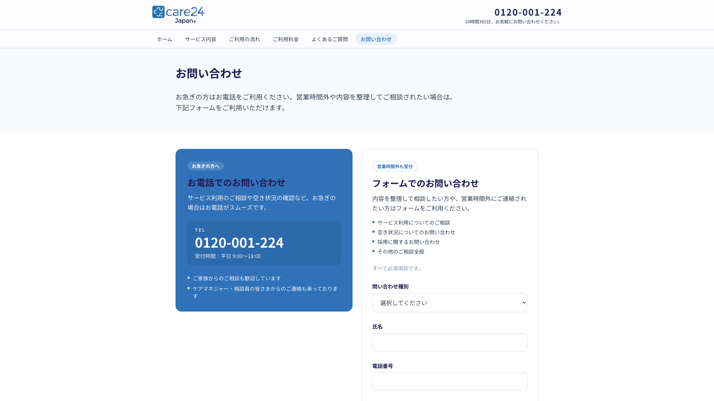
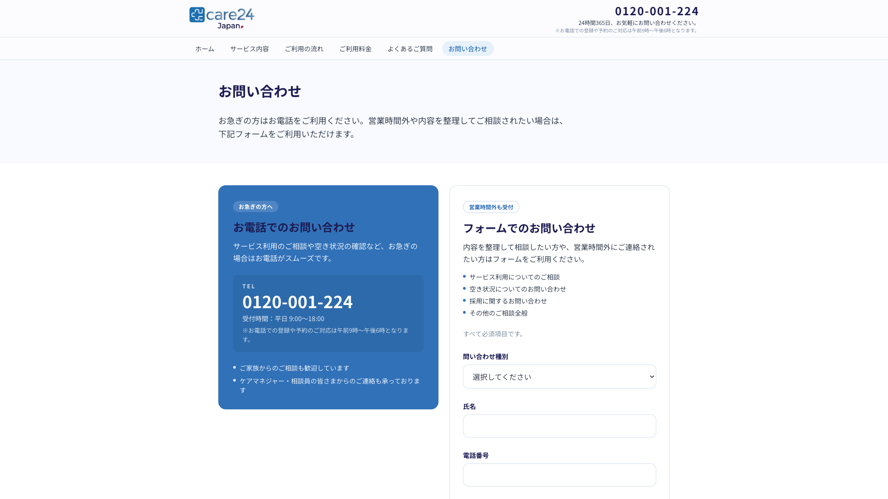

# Phone hours disclaimer — report

**Date:** 2026-09-25  
**Branch:** `client-revision-plan`  
**Status:** CMS patched + UI verified on local (`localhost:3000`). Production still needs code deploy for Navbar / Sticky CTA / Contact rendering.

## Task

Add this copy in 3 places:

> ※お電話での登録や予約のご対応は午前9時〜午後6時となります。

| # | Place | Component | CMS source |
|---|---|---|---|
| 1 | Navbar — under `24時間365日、お気軽にお問い合わせください。` | `Navbar` `PhoneBlock` | `site` / `site-contact-phone` / `phone_note` |
| 2 | Sticky CTA — under phone number near footer buttons | `StickyCta` | same `phone_note` |
| 3 | Contact page phone card — under `受付時間：平日 9:00〜18:00` | `ContactView` | `contact` / `contact-phone-card` / `note` |

## Updates

1. **UI**
   - Render optional `hoursNote` in Navbar under the 24/7 note (condensed `max-h` adjusted).
   - Sticky CTA + Contact already render optional note; kept as-is.
2. **Atlas CMS**
   - Ran `npx tsx scripts/atlas/patch-phone-hours-note.ts`
   - Updated `site.site-contact-phone.phone_note` and `contact.contact-phone-card.note`
3. **Tests**
   - `sticky-cta.test.tsx` — hours note case
   - `site.test.ts` — maps `phone_note` → `hoursNote`
   - `contact-map.test.ts` — pass

## Before / After

### 1. Navbar (header phone)

**Before** — phone + 24/7 line only:

**After** — disclaimer under the 24/7 line:

### 2. Sticky CTA (footer bar)

**Before** — number without disclaimer:

**After** — disclaimer under the number:

### 3. Contact page

**Before** — hours line only:

**After** — disclaimer under 受付時間:

## Notes

- After screenshots are from **local** (`http://localhost:3000`) with live Atlas content. Production (`care24.jp`) will show the same once this UI code is deployed.
- `home-contact.phone_note` already had the same string in Atlas (not patched in this run); home section may also show it via existing optional wiring, but it is **not** one of the 3 requested places.
